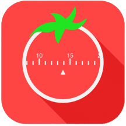

<h3 align="center">Pomodoro Together App</h3>

    
    
    

### Descripción

La técnica del Pomodoro consiste en dividir el tiempo en periodos de 25 minutos de trabajo o enfoque hacia alguna tarea, separados por pausas dedicadas al descanso. Mediante **esta aplicación** conseguimos que un método solitario como puede parecer el anterior, se pueda hacer de forma **grupal**.

Para ello, añadimos los proyectos, que son agrupaciones de pomodoros en los que se permite a los miembros hacer un pomodoro al mismo tiempo, con posibilidad de *chat* en los periodos de descanso.

[Documentación pdf](https://github.com/pauladj/pomodoro-together-app/blob/images/Documentaci%C3%B3n.pdf)

[Presentación pdf](https://github.com/pauladj/pomodoro-together-app/blob/images/Presentaci%C3%B3n.pdf)

### Herramientas y conceptos utilizados

- **Google Firebase** y **mysql** para almacenar los datos.

- **Transacciones** para asegurarse de que todos los datos se envían correctamente.
- **Componente personalizado** "SeekArc" para el *countdown* de los pomodoros. 
- También se utilizan **servicios**, **notificaciones**, ***timers*** y ***event bus***.
- **RecyclerView** con 2 plantillas y **cardviews**.
- Aplicación **multi idioma** a elección del usuario.

### Capturas de pantalla

&nbsp;&nbsp;&nbsp;&nbsp;

### Índice de funcionalidades

- Registrarse/Iniciar sesión
- Crear proyecto 
- Crear pomodoro individual/proyecto
- Detener/abandonar el pomodoro
- Añadir usuario a proyecto
- Salir del proyecto
- Empezar/unirse a pomodoro
- Chat en el pomodoro
- Configuración del usuario

### Archivos del código fuente

- **web-php:** Código del servidor que gestiona las llamadas externas de la aplicación.  Por ejemplo, llamadas a *Google Firebase*.
- **/pomodoro/app/src/main** Código fuente de la aplicación de Android.
- **Documentación.pdf**: Informe con tutorial de uso entregado.
- **Presentación.pdf:** Presentación del proyecto.

### Miembros del equipo

La aplicación se ha realizado por Paula de Jaime (<a href="https://github.com/pauladj">@pauladj</a>) y Erika Bracamonte (<a href="https://github.com/erikab2731">@erikab2731</a>).

